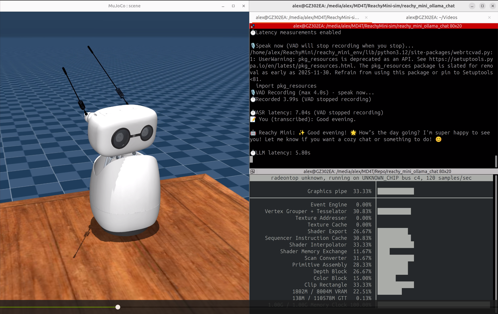

# Reachy Mini — Ollama Chat + Emotion/Dance Demo


"Don't have physical hardware? You can still create your own virtual robot on your desk. This represents a straightforward sim-to-real practice leveraging MuJoCo and AI tools like Faster Whisper, Ollama, and eSpeak/Edge-TTS. While Edge-TTS relies on cloud APIs, eSpeak enables fully offline operation. I developed this on the AMD Strix Halo platform and tested it on an AMD Radeon GPU with Ubuntu. Although untested on other systems, the architecture should facilitate easy porting to macOS and Windows."




## Short summary
- This repository contains demo apps and controllers for the Reachy Mini simulator and small robot, focused on emotion-driven and dance actions triggered from language model outputs (Ollama). It includes several experimental versions (`emo_v1` → `emo_v8`) that explore recorded-move playback, streaming-triggered motions, and TTS integration.

What you'll find
- `emo_v1.py` — Baseline high-intensity emotion controller and examples.
- `emo_v2.py` — RecordedMoves categorization and selection.
- `emo_v3.py` — Streaming LM responses triggering actions early.
- `emo_v4.py` — Offline-focused TTS (eSpeak) with lip-sync hooks.
- `emo_v5.py` — Edge-TTS integration with WAV save/read/play flow (multi-language support).
- `emo_v6.py` — Continuous synchronized actions with cartoon voices and multi-modal expressions.
- `emo_v7.py` — ASR → LLM → TTS demo (see EMO_V7_README.md)
- `emo_v8.py` — Offline Piper-TTS version (ASR/text chat + Ollama + Piper)

Get the details of each version from [./docs](./docs)

## Installation prerequisites (Linux / Debian-family)

This project was developed on an AMD Ryzen™ AI Max+ 395 running Ubuntu 24.04. I recommend this hardware for deployment, as it pairs excellently with the Reachy Mini Desktop Robot. Its integrated GPU and CPU deliver the performance needed to run the full pipeline entirely offline.

So you may follow the [AMD ROCm Documentation](
https://rocm.docs.amd.com/projects/radeon-ryzen/en/latest/docs/install/installryz/native_linux/install-ryzen.html) to install Ryzen Software for Linux with ROCm.

Then go to setup the environment for this application.

1. System packages

```bash
sudo apt update
sudo apt install -y python3 python3-venv python3-pip espeak ffmpeg libsndfile1 portaudio19-dev
sudo apt-get install -y libcairo2-dev
sudo apt install -y libgirepository1.0-dev
sudo apt install -y \
    python3-gi \
    gir1.2-gst-plugins-base-1.0 \
    libgstreamer1.0-0 \
    gstreamer1.0-tools \
    gstreamer1.0-plugins-base \
    gstreamer1.0-plugins-good \
    gstreamer1.0-plugins-bad \
    gstreamer1.0-libav
```

**Notes:**
- `espeak` (eSpeak) is required for the offline TTS flow used by `emo_v4.py`.
- `libsndfile1` and `portaudio` are required for `soundfile` and `sounddevice` (used when playing WAVs).
- `ffmpeg` is optional but useful if you need to convert audio formats or debug audio files.

2. Python environment

```bash
git clone https://github.com/alexhegit/ReachyMiniChat.git
cd ReachyMiniChat
python3 -m venv venv
source venv/bin/activate
pip install --upgrade pip
pip install -r requirements.txt
```

3. Reachy Mini Python SDK.

- Install reachy-mini SDK with Mujoco support for simulation:

```bash
pip install "reachy-mini[mujoco]"
```

4. Ollama

- Install Ollama from https://ollama.com/download. Then install it and pull Qwen3:0.6B which is the LLM we used in this repo.

```bash
# Linux
curl -fsSL https://ollama.com/install.sh | sh
ollama pull qwen3:0.6b
ollama serve
```

## Run it

1. Start the Reachy Mini simulation in terminal 1:

Use `export PYGLFW_LIBRARY_VARIANT=x11` if the GUI launch fails on Wayland, which is the default backend of Ubuntu 24.04+.

```bash
export PYGLFW_LIBRARY_VARIANT=x11
reachy-mini-daemon --sim
```

If you have the real Reachy Mini connected, you could play with it by 

```bash
reachy-mini-daemon
```

2. Quick test commands (terminal 2)

```bash
# Run the action tests (plays recorded moves + emotions)
python ./utils/test_actions.py

# Test TTS in emo_v5 (Edge-TTS path) — the script includes a --test-tts flag in emo_v5
python emo_v5.py --test-tts

# Test eSpeak offline TTS in emo_v4
python emo_v4.py --test-tts
```

## Project notes and troubleshooting
- If you hear noisy or distorted audio, ensure `soundfile` and `sounddevice` are installed in the active venv, and that the system `libsndfile` and PortAudio development packages are present.
- `emo_v5.py` writes Edge-TTS output to WAV and plays it back using the file's sample rate to avoid playback artifacts.
- `emo_v4.py` uses `espeak --stdout` as the primary offline TTS backend; ensure eSpeak is installed.

## emo_v7 (ASR → LLM → TTS)
- `emo_v7.py` adds a microphone-first pipeline using `faster-whisper` (CPU) for ASR, then forwards the transcription to Ollama and uses the existing emotion controller + Edge-TTS for speech and actions.
- See [EMO_V7_README.md](EMO_V7_README.md) for usage, requirements, and notes about model choices and VAD improvements.
- New CLI flag: `--gentle` — enables gentle_mode which restricts selected recorded moves to a curated gentle set and adjusts motion durations for subtler actions. Example:

```bash
python emo_v7.py --asr --gentle
```

## emo_v8 (Offline Piper-TTS)
- `emo_v8.py` replaces Edge-TTS with Piper-TTS for fully offline speech synthesis, while keeping Ollama chat and emotion/action flow.
- New dependency is already included in `requirements.txt`:
  - `piper-tts>=1.4.0`
- `emo_v8.py` also supports `--gentle` (same behavior as emo_v7/emo_v6) and accepts `--piper-model` and `--piper-config` to point to local voice models. Example:

```bash
python emo_v8.py --model qwen3:0.6b --piper-model models/zh_CN-huayan-medium.onnx --gentle
```

Piper voice model download
- Download `.onnx` and matching `.onnx.json` voice files from:
  - Piper release page: `https://github.com/rhasspy/piper/releases/tag/v0.0.2`
- Place files under `models/` (or any path you pass to `--piper-model`).

Usage examples
```bash
# Text chat mode + english (default)
python emo_v8.py --model qwen3.5:0.8b --piper-model models/en-us-blizzard_lessac-medium.onnx

# ASR mode + Chinese 
python emo_v8.py --asr --model qwen3.5:0.8b --piper-model models/zh_CN-huayan-medium.onnx --gentle

# ASR + gentle action + Chinese
python emo_v8.py --piper-model ./models/zh_CN-huayan-medium.onnx --gentle --model qwen3.5:0.8b

# Optional: explicit Piper config/speaker
python emo_v8.py --piper-model models/en-us-blizzard_lessac-medium.onnx --piper-config models/en-us-blizzard_lessac-medium.onnx.json --speaker 0
```

## Version History
- See [EMO_README.md](EMO_README.md) for version details and changelog across `emo_v*` versions.
